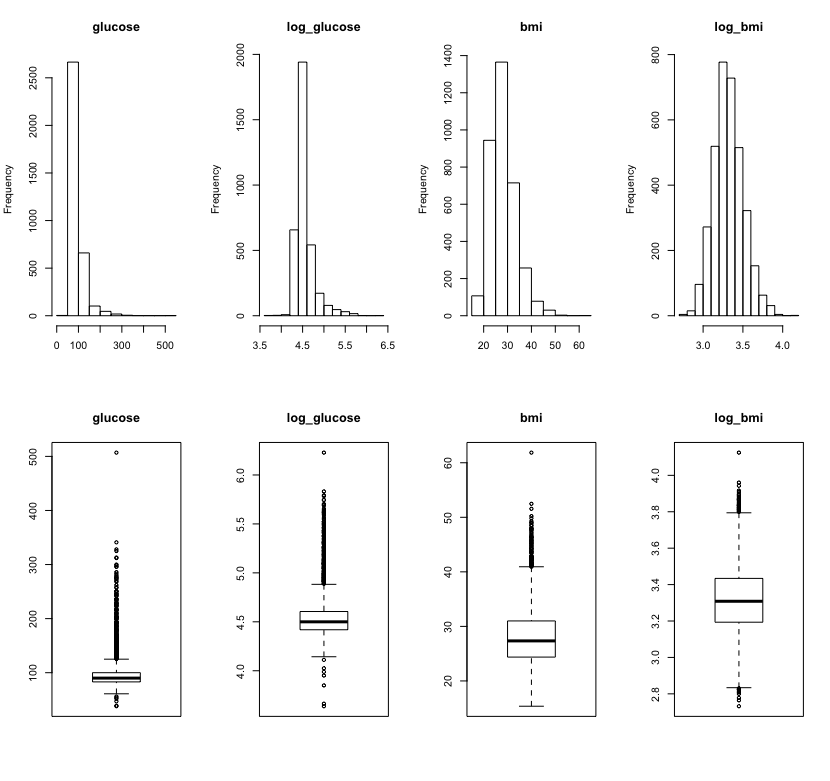
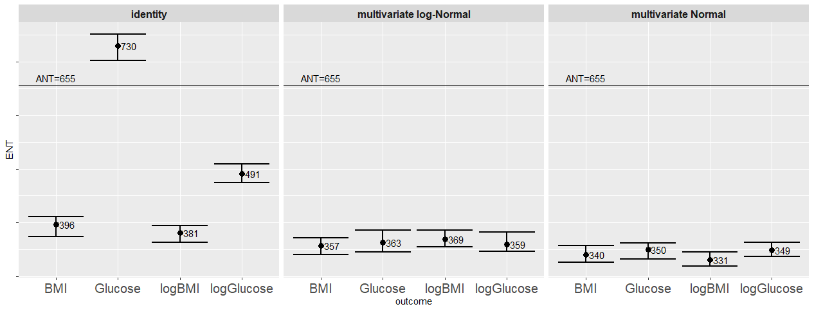

# PhenoMeNal(Phenome and Metabolome aNalysis) - processing and analysis of molecular phenotype data generated by metabolomics applications

Permutation-based and closed-form-expression tools for the estimation of metabolome-wide significance level (MWSL) and corresponding effective number of tests for (correlated) metabolomics data. 
This [paper](https://www.biorxiv.org/content/early/2019/01/13/478370) describes a possible application.

## Section 0: Import the R package

The `MWSL` R package allows for 
* Estimation of permutation-based MWSL and corresponding effective number of tests (ENT)
* Estimation of closed-form-expression MWSL and corresponding effective number of tests (Meff)
* Identification of differentially regulated metabolomics variates for a specific clinical outcome

```
devtools::install_github("AlinaPeluso/PhenoMeNal", subdir="MWSL")
library(MWSL)
```


## Section 1: Exploratory analysis

We aim to investigate the association between human serum $^{1}$H NMR metabolic profiles and various clinical outcomes in the Multi-Ethnic Study of Atherosclerosis ([MESA](https://academic.oup.com/aje/article/156/9/871/255904)). The data have been extensively described in this [paper](https://www.ncbi.nlm.nih.gov/pubmed/28823158).  

The original study considers three sets of NMR spectra data: (1) a standard water-suppressed one-dimensional spectrum (NOESY), and (2) a Carr-Purcell-Meiboom-Gill spectrum (CPMG), and (3) a lower resolution version of the CPMG data (BINNED). The BINNED version consists of `M = 655` features, while the NOESY and CPMG contain `M = 30,590` features. The BINNED data sample comprises of `n = 3500` individuals, while the NOESY and CPMG data have `n = 3,867` individuals. 

To illustrate the package capabilities, here we reproduce the results for the BINNED version of the data. 

```
data("MESA_binned")
```

#### Metabolomics variates

For this specific analysis the metabolomics variates are anonimised and simply referred to as `V1,V2,...,V655`.
```
features <- MESA_binned[,23:(ncol(MESA_binned)-1)]
```

Descriptive statistics of the metabolomics variates:

`
t(round(sapply(features, function(x) c(mean=mean(x),sd=sd(x),median=median(x),min=min(x),max=max(x))),2))
`
| feature | mean  | sd    | median | min     | max   |
|---------|-------|-------|--------|---------|-------|
| V1      | 0\.13 | 0\.98 | 0\.03  | \-2\.44 | 5\.33 |
| V2      | 0\.15 | 0\.78 | 0\.05  | \-1\.66 | 3\.73 |
| V3      | 0\.05 | 0\.95 | 0\.02  | \-3\.17 | 3\.83 |
| V4      | 2\.85 | 0\.99 | 2\.79  | 0\.04   | 6\.38 |
| V5      | 1\.75 | 0\.99 | 1\.73  | \-2\.29 | 5\.85 |
| …       | …     | …     | …      | …       | …     |
| V651    | 0\.04 | 1\.01 | 0\.03  | \-7\.21 | 4\.25 |
| V652    | 0\.01 | 1\.01 | 0\.04  | \-6\.48 | 4\.63 |
| V653    | 0     | 1\.01 | 0\.03  | \-4\.81 | 5\.51 |
| V654    | 0\.03 | 1\.01 | 0\.03  | \-3\.74 | 4\.08 |
| V655    | 0\.02 | 1\.01 | 0\.03  | \-4\.09 | 4\.54 |


#### Fixed effects confounders

Briefly, the cohort includes participants (51\% females, 49\% males), aged 44-84 years, (mean age of 63 years) from four different ethnic groups: Chinese-American, African-American, Hispanic, and Caucasian, all recruited between 2000-2002 at clinical centres in the United States and free of symptomatic cardiovascular disease at baseline. Demographic, medical history, anthropometric, and lifestyle data, as well as serum samples were collected, together with information on diabetes, and lipid and blood pressure treatment. 

```
MESA_binned$male <- ifelse(MESA_binned$sex<2,1,0)
confounders <- MESA_binned[,c("age","male","height","ethnicityH","ethnicityAA","ethnicityCA","smokingF","smokingC","ldl_chol","hdl_chol","sbp","bp_treatment","diabetes","lipids_treatment")]
```

Descriptive statistics of the clinical outcomes measures:
```
t(round(sapply(MESA_binned[,c(7,9:22,ncol(MESA_binned))], function(x) c(mean=mean(x),sd=sd(x),median=median(x),min=min(x),max=max(x))),3))

```
| confounder        | mean     | sd      | median | min    | max    |
|-------------------|----------|---------|--------|--------|--------|
| age               | 62\.888  | 10\.327 | 64     | 44     | 84     |
| height            | 166\.433 | 10\.237 | 166\.3 | 123\.8 | 196\.7 |
| ethnicityC        | 0\.385   | 0\.487  | 0      | 0      | 1      |
| ethnicityH        | 0\.234   | 0\.424  | 0      | 0      | 1      |
| ethnicityAA       | 0\.255   | 0\.436  | 0      | 0      | 1      |
| ethnicityCA       | 0\.127   | 0\.333  | 0      | 0      | 1      |
| smokingN          | 0\.503   | 0\.5    | 1      | 0      | 1      |
| smokingF          | 0\.121   | 0\.326  | 0      | 0      | 1      |
| smokingC          | 0\.376   | 0\.485  | 0      | 0      | 1      |
| ldl\_chol         | 117\.678 | 31\.043 | 116    | 20     | 315    |
| hdl\_chol         | 51\.3    | 14\.42  | 49     | 21     | 133    |
| sbp               | 126\.922 | 21\.54  | 124    | 77     | 218    |
| bp\_treatment     | 0\.376   | 0\.484  | 0      | 0      | 1      |
| diabetes          | 0\.135   | 0\.342  | 0      | 0      | 1      |
| lipids\_treatment | 0\.167   | 0\.373  | 0      | 0      | 1      |
| male              | 0\.489   | 0\.5    | 0      | 0      | 1      |


#### Clinical outcomes measures

The outcomes of interest are glucose concentrations and the body mass index or BMI. 

```
glucose <- MESA_binned[,1]; log_glucose <- MESA_binned[,2]; bmi <- MESA_binned[,7]; log_bmi <- MESA_binned[,8];
outcomes <- MESA_binned[,c(1:4)]
```

Descriptive statistics of the clinical outcomes measures:
```
t(round(sapply(MESA_binned[,c(1:4)], function(x) c(mean=mean(x),sd=sd(x),median=median(x),min=min(x),max=max(x))),2))
```
| outcome      | mean   | sd    | median | min    | max    |
|--------------|--------|-------|--------|--------|--------|
| glucose      | 97\.55 | 29\.6 | 90     | 38     | 507    |
| log\_glucose | 4\.55  | 0\.22 | 4\.5   | 3\.64  | 6\.23  |
| bmi          | 28\.14 | 5\.39 | 27\.34 | 15\.36 | 61\.86 |
| log\_bmi     | 3\.32  | 0\.18 | 3\.31  | 2\.73  | 4\.12  |


Plot of the distributions of the clinical outcomes measures:
```
par(mfrow=c(2,4))
for (i in 1:ncol(outcomes)){hist(outcomes[,i],main=names(outcomes)[i],xlab=NULL)}
for (i in 1:ncol(outcomes)){boxplot(outcomes[,i],main=names(outcomes)[i],xlab=NULL)}
```



## Section 2: Permutation-based MWSL and ENT estimation

```
methods <- c('identity','mN','mlogN')
mat <- matrix(NA,3,8)
colnames(mat) <- c('MWSL','MWSL_CI.up','MWSL_CI.low','ENT','ENT_CI.up','ENT_CI.low','R.percent','t1err.percent')
rownames(mat) <- methods
rmesa_FWERperm <- list(glucose=mat,log_glucose=mat,bmi=mat,log_bmi=mat);
for (j in 1:length(methods)){
  for (i in 1:ncol(outcomes)){
    rmesa <- FWERperm(outcome=outcomes[,i],
                      features=features,
                      confounders=confounders,
                      n.permutation=10000,
                      method=methods[j],
                      verbose=F)
    rmesa_FWERperm[[i]][j,1:7] <- rmesa$res
    rmesa_FWERperm[[i]][j,8] <- rmesa$t1err.percent
  }
}
```


##### Plot of the ENT estimates from the permutation procedure
```
df_rmesa_FWERperm <- do.call(rbind,rmesa_FWERperm)
df1_rmesa_FWERperm<- data.frame(
  outcome = c('glucose','glucose','glucose',
              'logGlucose','logGlucose','logGlucose',
              'BMI','BMI','BMI',
              'logBMI','logBMI','logBMI'),
  type = c('identity','multivariate Normal','multivariate log-Normal',
           'identity','multivariate Normal','multivariate log-Normal',
           'identity','multivariate Normal','multivariate log-Normal',
           'identity','multivariate Normal','multivariate log-Normal'),
  ENT = c(df_rmesa_FWERperm[,4]),
  ENT.ciUP = c(df_rmesa_FWERperm[,5]),
  ENT.ciLOW = c(df_rmesa_FWERperm[,6]))
(plot_res.MESA_co <- ggplot(data=df1_rmesa_FWERperm,aes(x=outcome,y=ENT)) +
    facet_grid(~ type) +
    geom_hline(yintercept=ncol(features)) +
    annotate("text",x='BMI',y=(ncol(features)+15),label='ANT=655') +
    geom_text(mapping=aes(label=round(ENT,0)),hjust=-.5)+
    geom_point(size=3) +
    geom_errorbar(aes(ymin=ENT.ciLOW,ymax=ENT.ciUP),size=1) +
    theme(text = element_text(size=20)) +
    theme(legend.position="bottom") +
    theme(axis.text.x = element_text(angle=30, hjust=1)) +
    theme(axis.text.y = element_blank()) +
    ggtitle("MESA_binned data - all clinical outcomes")
)
```


From the conventional permutation procedure applied to the BINNED data, when the real features are considered, there is instability in the estimation of the ENT across the different outcomes, and in particular the ENT estimate for glucose is above the ANT. When the feature data are simulated from a multivariate log-Normal or Normal distribution, the ENT estimates are stable across the different outcomes and remain bounded below the total number of features with an average ENT of 352 and an R ratio of 53.8%. 


## Section 3: Closed form expression eigenvalues-based MWSL and ENT estimation

## Section 4: Identification of outcome-specific differentially regulated  metabolites
